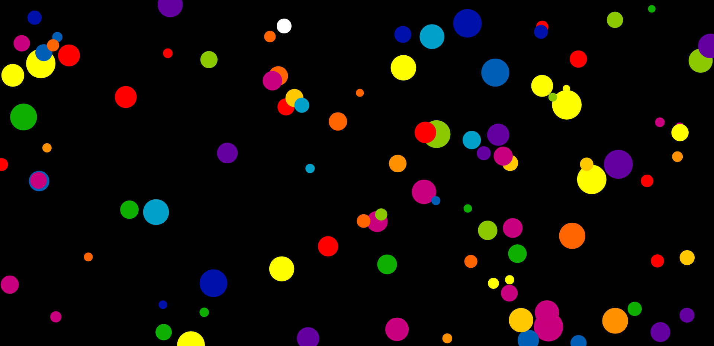

# Circle Catcher - The Circle Game 

In this game, the player controls a white circle with their mouse and attempts to eat other circles of various sizes to increase their own size. The objective of the game is to become the largest circle possible without being eaten by a larger circle.

> `NOTE:` This game is designed for desktop/laptop users and may not function optimally on mobile or tablet devices.

## Screenshots

### Difficulty Modes 

### Gameplay

### Game Over

## How to Play

To play the game:

- Use your mouse to control the movement of the white circle.
- Move the white circle around the game area to locate smaller circles to eat.
- The white circle will automatically eat any smaller circles that it comes into contact with. As the white circle eats smaller circles, its size will increase.
- Avoid larger circles as they will eat the white circle and end the game.

## Controls

Use your mouse to move the white circle.

## Difficulty Modes

Circle Game has three difficulty modes: easy, medium, and hard. In each mode, a different number of random circles will be generated on the screen.

- Easy: 10 random circles
- Medium: 50 random circles
- Hard: 120 random circles

To select a difficulty mode, simply click on the corresponding button on the main menu.

## Game Over

The game is over when the white circle is eaten by a larger circle. The player can then choose to start a new game or exit the game.

## Installation

No installation is required to play this game. Simply download the necessary files and open the index.html file in a web browser.

## Credits

This game was created by Shivam Taneja as a fun project to practice web development skills. The game mechanics and graphics were implemented using pure vanilla JavaScript, manipulating the canvas properties of the HTML DOM to render the game on the web page. No external libraries were used in the development of this project.

- LinkedIn: [Shivam Taneja](https://www.linkedin.com/in/shivam-taneja/)

## Future Ideas

- Add user profiles
- Keep track of scores
- Display "Top Scores for Today" on the main menu.

## License
Feel free to use and modify the code to create your own version of the game.
